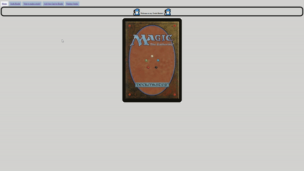
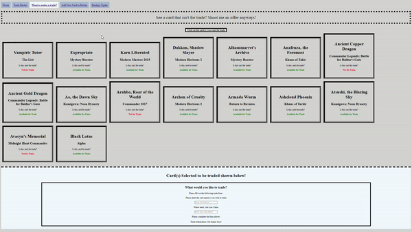
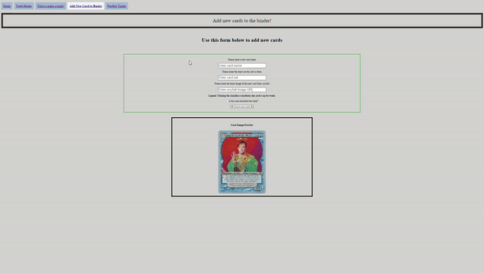
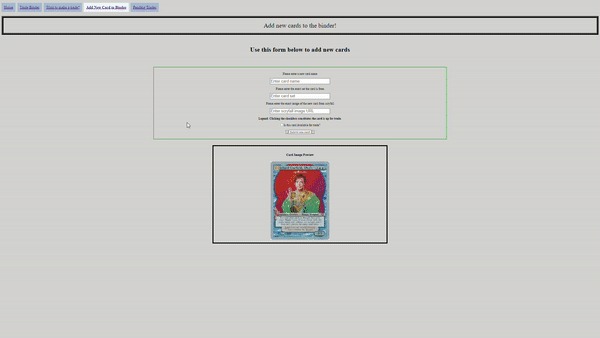

# My Magic the Gathering Trade Binder
Hello there!
This is the second project I will be presenting at Flatiron! I am super excited to go through this journey to learn and master the coding language that is React. For this project, I decided to tackle another hobby of mine: collecting cards from the TCG (trading card game) that I like to call Muhicccc! The Miglee-oon, or MTG for short. I wanted to create a way to catalog my ever-growing collection to trade with people.

<br></br>
<p align="center">

</p>
<br></br>

My love for the game started at the end of my high school career. I have always tried to get into a TCG that challenged me in deck-building creativity. Pokemon, Yugioh, Zach Bell, Digimon, and even the DragonBall Z TCGs were some of the card games I got into before finding my true love. I knew of Magic's existence from my days collecting Pokemon cards, but I did not know anyone who actually played the game. 

<br></br>
<p align="center">

</p>
<br></br>

The card image above was the first rare I ever pulled in Magic the Gathering, way back around 2006... Four years before, I learned actually to play the game. The art from this card and several others command the respect of many collectors. 

It was not until 2010 that I met people that showed me how to play this fantastic game for the first time. With the summer coming up and enough free time, my friend Noos and I would hit our LGS at the time, Collect-A-Card & Comics. This was the prime time for MTG as the Zendikar block was going strong, and the "new at the time" Mirrodin block was about to drop. 

<br></br>
<p align="center">

</p>
<br></br>

This guy here... was the big boogie man at that time in Standard, a trendy format then. Commander at the time of writing is the most prevalent format to date. I have had such good memories with this game, from playing with my then-girlfriend, now my wife. To meeting new people that challenged my creativity even further in deck building. I wanted to add flavor to the game by making proxy cards with new art. 

I love this game dearly... I have even given my firstborn son the name Gideon to honor the late great white Hieromancer Gideon Jura. A noble and powerful Planeswalker with a firm conviction for truth and justice. Unfortunately, he met his demise in the War of the Spark set when he sacrificed himself to defend his friend Liliana, which ultimately helped seal the great evil at the time Nicol Bolas. However, as seen in the card below... his death meant victory for the Gatewatch and the Multiverse. (I am tearing up as I write this... this character has had a significant impact on my life.)

<br></br>
<p align="center">

</p>
<br></br>

**Add App walkthrough here**

Here we have our Links that will display each page of my project using browserRouter, Switch, and Route
 <br></br>
 
 

 Shown below is the links working to show my trade binder
 <br></br>
 
 

You can also request a trade and see your pending trade as well!
<br></br>



Need to add a card to the binder? Not a problem! Use the add card form!



Once you've done that the binder and trade section will reflect the change for the added card!




### Installation Instructions
* Fork and clone the GitHub repo into your environment [here](https://github.com/Jessieg12/Magic-Trade-Binder).
* Install the JSON server into your code editor with the following command. 
    ```bash
     npm install -g json
     ```
* Install npm dependencies with the following command
    ```bash
     npm install
     ```
* Install react-router-dom v5 which the app was built upon
    ```bash
     npm install react-router-dom@5
     ```

### Requirements
* To run our db.json file needed for this app have a JSON server installed to have access to the needed data.
* If/once JSON-server is installed, you will need to run the JSON-server command in your terminal to have the db.json file running inside the app's directory. 
    ```bash
    json-server --watch db.json --port 3007
    ```
  * Not a requirement but a strong suggestion, VS users should install the Live Server extension for ease of access to the app's webpage.

### Credits
 * All of the photos used in this application were sourced from Scryfall's website for clarity.
 * I owe it all to my best friend, Alyssa who never gave up on me. Julian, my baby boy, always smiles at me when I'm down. Love you both dearly.
 * To all of my friends who helped me learn the wonderful game of Magic, to the entire Magic the Gathering community, and to Wizards of the Coast for giving us such an amazing game. 